# Campus Chatbot 🎓

A natural language interface for querying college timetables. Ask questions in plain English and get instant answers about class schedules, teachers, rooms, and timings.

## Overview

Campus Chatbot uses AI to understand natural language questions. Instead of manually searching through timetable PDFs, simply ask "When is my next class with Dr. Ritu?" or "What classes do I have on Monday?"

## Features

- **Natural Language Queries**: Ask questions in plain English
- **Smart SQL Generation**: Automatically converts questions to database queries
- **Teacher Name Matching**: Handles typos and variations in teacher names
- **Comprehensive Coverage**: Handles queries about timing, rooms, subjects, and class types
- **Future Proof**: Even if the timetable changes, just run "[parse_db](database\parse_db.py)" and "[create_db](database/create_db.py)" with new pdf file-path.

## Tech Stack

- **Backend**: FastAPI
- **Frontend**: Streamlit
- **Database**: MySQL
- **AI Models**: Google Gemini 2.5 Flash (via LangChain)
- **PDF Processing**: Camelot
- **Data Processing**: Pandas, NumPy

## Architecture

```mermaid
graph TB
    User[👤 User<br/>Student Query]
    
    User -->|Interacts| Frontend[🎨 Streamlit UI<br/>frontend.py]
    
    Frontend -->|HTTP Request| API[⚡ FastAPI Backend<br/>backend.py]
    
    API -->|Natural Language| QueryModel[🤖 Query Model<br/>Gemini 2.5 Flash<br/>LangChain]
    
    QueryModel -->|SQL Query| DB[(🗄️ MySQL Database<br/>Timetable Data)]
    
    DB -->|Results| ResponseModel[🤖 Response Model<br/>Gemini 2.5 Flash<br/>LangChain]
    
    ResponseModel -->|Natural Language| API
    API -->|JSON Response| Frontend
    Frontend -->|Display| User
    
    PDF[📄 Timetable PDF] -->|Camelot Parser| Parser[🔧 PDF Parser<br/>parse_db.py]
    Parser -->|CSV Data| DBCreator[🔨 DB Creator<br/>create_db.py]
    DBCreator -->|Populate| DB
    
    style User fill:#9333ea,stroke:#7c3aed,color:#fff
    style Frontend fill:#3b82f6,stroke:#2563eb,color:#fff
    style API fill:#8b5cf6,stroke:#7c3aed,color:#fff
    style QueryModel fill:#f59e0b,stroke:#d97706,color:#fff
    style ResponseModel fill:#f59e0b,stroke:#d97706,color:#fff
    style DB fill:#10b981,stroke:#059669,color:#fff
    style PDF fill:#ef4444,stroke:#dc2626,color:#fff
    style Parser fill:#06b6d4,stroke:#0891b2,color:#fff
    style DBCreator fill:#06b6d4,stroke:#0891b2,color:#fff
```



1. **PDF Parser** (`database/parse_db.py`): Extracts timetable data from PDF
2. **Database Creator** (`database/create_db.py`): Populates MySQL database
3. **Query Model** (`ai_models/query_model.py`): Converts natural language to SQL
4. **Response Model** (`ai_models/response_model.py`): Formats database results into friendly responses
5. **API** (`backend.py`): FastAPI endpoint for handling requests
6. **UI** (`frontend.py`): Streamlit interface for user interaction

## Installation

### Prerequisites

- Python 3.13.12
- MySQL Server
- Gemini API key

### Setup

1. **Clone the repository**
```bash
git clone https://github.com/ArunNegi112/Campus-agent.git
cd Campus-agent
```

2. **Install dependencies**
```bash
pip install -r requirements.txt
```

3. **Configure environment variables**

Create a `.env` file in the project root:
```env
DB_HOST=localhost
DB_NAME=timetable
DB_USER=your_mysql_username
DB_PASSWORD=your_mysql_password
GEMINI_API_KEY=your_gemini_api_key
```

4. **Set up the database**
- Open MySQL workbench and create database named "timetable"

```bash
# Parse PDF and populate database
python database/create_db.py
```

## Usage

### Starting the Application

1. **Start the FastAPI backend**
```bash
uvicorn backend:app --reload
```
The API will be available at `http://127.0.0.1:8000`

2. **Start the Streamlit frontend** (in a new terminal)
```bash
streamlit run frontend.py
```
The UI will open in your browser at `http://localhost:8501`

### Example Queries

- "When do we have Kriti Batra class on Monday?"
- "Show me all classes for AIML_II_B1 on Tuesday"
- "Find Khyati Chopra's schedule"
- "When do we have next class for subject code ARD-212"

## Database Schema

### Table: `tt`

| Column | Type | Description |
|--------|------|-------------|
| index | BIGINT | Row identifier |
| days | TEXT | Day of week (Mo, Tu, We, Th, Fr) |
| 9_00 | TEXT | 9:00 AM class details |
| 10_00 | TEXT | 10:00 AM class details |
| 11_00 | TEXT | 11:00 AM class details |
| 12_00 | TEXT | 12:00 PM class details |
| 13_00 | TEXT | 1:00 PM class details |
| 14_00 | TEXT | 2:00 PM class details |
| 15_00 | TEXT | 3:00 PM class details |
| 16_00 | TEXT | 4:00 PM class details |
| batch | TEXT | Batch identifier |

### Cell Format

Each non-empty cell represents a class session:
```
"<Faculty Name> <Program_Sem_Batch_Group> <Subject Code> <Room> <Class Type>"
```

Example:
```
"Aggarwal Dr. Ritu AIML-II_B1 AR-108 A-404"
```

## Currently supported batches

- **AIML** (II, IV, VI): B1, B2
- **AIDS** (II, IV, VI): B1, B2
- **AR** (II, IV, VI): B1, B2
- **IIOT** (II, IV, VI): B1, B2
- **PhD**

## Project Structure

```
campus-chatbot/
├── ai_models/
│   ├── query_model.py      # Natural language → SQL conversion
│   └── response_model.py   # SQL results → Natural language
├── database/
│   ├── create_db.py        # Database setup
│   ├── parse_db.py         # PDF parsing logic
│   └── TT_data/
│       └── tt.csv          # Extracted timetable data
├── backend.py              # FastAPI application
├── frontend.py             # Streamlit UI
├── requirements.txt        # Python dependencies
├── .env                    # Environment variables (create this)
├── .gitignore             # Git ignore rules
└── README.md              # This file
```

## Known Issues & Future Improvements

### Current Limitations

- Users must use subject codes instead of subject names
- No subject name dictionary implemented yet
- Chat history is not implemented

### Planned Enhancements

- Add subject code to subject name mapping
- Support queries using subject names
- User authentication
- Email/SMS notifications for upcoming classes
- Using better LLMs for Query and Response models


## Security Features

- SQL injection protection (blocks dangerous keywords)
- Only SELECT queries allowed
- Environment variable-based credentials
- Input validation with Pydantic

## Contributing

Contributions are welcome! Please follow these steps:

1. Fork the repository
2. Create a feature branch (`git checkout -b feature/AmazingFeature`)
3. Commit your changes (`git commit -m 'Add some AmazingFeature'`)
4. Push to the branch (`git push origin feature/AmazingFeature`)
5. Open a Pull Request

## Troubleshooting

### Common Issues

**"API quota exceeded"**
- Check your Google AI API key
- Verify you haven't exceeded free tier limits

**"Could not connect to backend"**
- Ensure FastAPI is running on port 8000
- Check if another application is using the port

**"Database connection failed"**
- Verify MySQL is running
- Check `.env` credentials
- Ensure `timetable` database exists

**"No results found"**
- Check if database is populated: `python database/create_db.py`
- Verify teacher name spelling (see full list in `query_model.py`)
- Try using subject code instead of subject name


**Version**: 1.0.0  
**Last Updated**: February 2026


